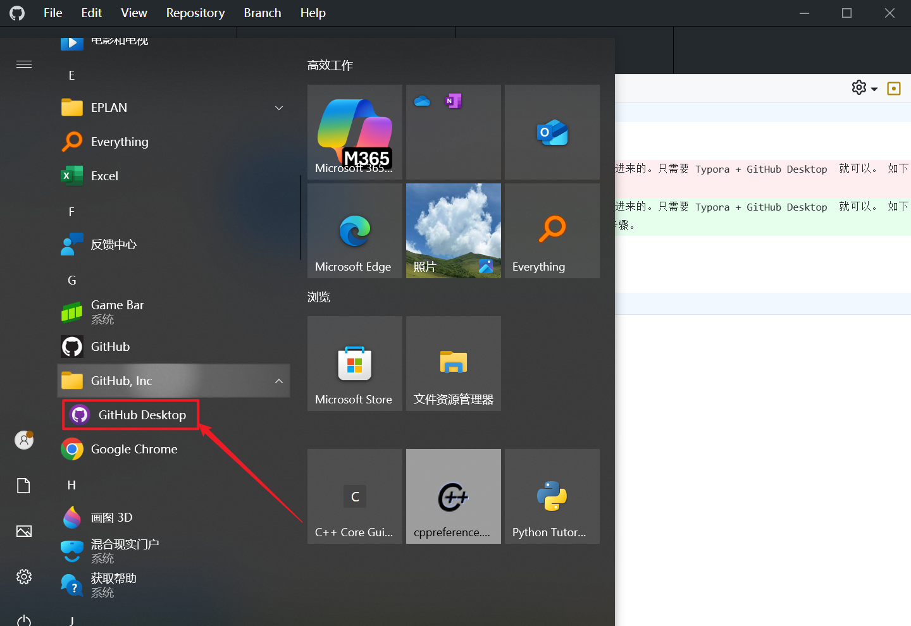
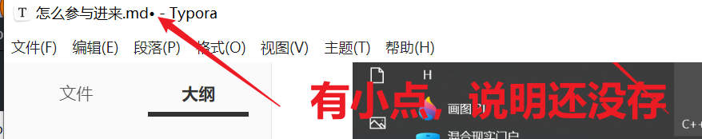

# 怎么参与进来？

嗨，既然你看到了这里，那么相信你是有意愿，参与进来的。只需要 Typora + GitHub Desktop  就可以。 如下是依据 DeepSeek 以及实践经验，所创总结出来的步骤。

---

### ✅ **极简协作方案：Typora + GitHub Desktop**
#### 优势对比
| **功能**   | Typora+GitHub Desktop | Obsidian+GitHub        |
| ---------- | --------------------- | ---------------------- |
| 编辑体验   | ⭐⭐⭐⭐⭐ 实时渲染超流畅  | ⭐⭐⭐ 需切换预览模式     |
| 学习成本   | ⭐ 5分钟上手           | ⭐⭐ 需学插件/双链笔记   |
| 流程图支持 | ✅ 原生Mermaid渲染     | ✅ 需装插件             |
| 协作流畅度 | ✅ 改完直接提交        | ⚠️ 需Obsidian保存再提交 |
| 安装复杂度 | 仅2个软件             | 软件+插件+配置         |

---

### 🛠️ **四步协作流程（Typora版）**
#### 步骤1：成员克隆仓库（GitHub Desktop）
1. 安装 [GitHub Desktop](https://desktop.github.com/)
2. 登录账号 → `File` → `Clone Repository` → 选择目标仓库  
   

#### 步骤2：用Typora编辑文档
1. **打开文件**：  
   - 在仓库文件夹右键 `.md` 文件 → `Open with Typora`  
   - 或启动Typora → `File` → `Open` → 选择文件
2. **插入内容**：  
   | **类型** | **操作**                                  |
   | -------- | ----------------------------------------- |
   | 流程图   | 输入 ````mermaid` → 写语法 → **实时渲染** |
   | 图片     | 直接拖拽到文档 → 自动保存到仓库文件夹     |
   | 超链接   | `[文字](URL)` 或 `Ctrl+K`                 |
   ```mermaid
   graph LR
   A[编辑文档] --> B{是否完成？}
   B -->|是| C[提交到GitHub]
   B -->|否| A
   ```

#### 步骤3：提交更改（GitHub Desktop）
1. 保存Typora文档（`Ctrl+S`）
2. 打开GitHub Desktop → 自动检测修改 → 填写摘要 → 点击 **`Commit to main`**  
   
3. 点击 **`Push origin`** 推送至GitHub

#### 步骤4：管理员处理PR（无冲突时）
- **成员推送后自动创建PR** → 管理员在GitHub点 `Merge pull request`  

---

### 💡 **高效协作技巧**
#### 1. 避免文件冲突
- **操作建议**：  
  - 编辑前先点击 **`Fetch origin`** 同步最新版  
  - 按领域分工：用户A只改`/docs`，用户B只改`/tutorials`
- **冲突解决**：  
  冲突时GitHub Desktop会高亮显示 → 手动选择保留谁的版本

#### 2. 自动化Typora图片路径
- **设置**：  
  `Typora设置` → `图像` → 选择 **“复制到指定路径”** → 路径填 `./images`  
  
- **效果**：  
  拖入图片自动保存到仓库的`/images`文件夹，链接自动生成 ``

#### 3. 免PR快速更新（适合小团队）
- **开启直接推送权限**：  
  仓库 `Settings` → `Collaborators` → 赋予成员 **`Write`** 权限  
  → 成员可直接 `Push` 无需PR（省去合并步骤）

---

### ⚠️ **注意事项**
| **问题**             | **解决方案**                                                 |
| -------------------- | ------------------------------------------------------------ |
| 成员忘记同步导致冲突 | 约定 **“编辑前必Pull”** 规则，用GitHub Desktop弹窗提醒       |
|                      |                                                              |
| 手机查看需求         | 仓库发布为GitHub Pages → 生成 `https://xxx.github.io` 链接（支持手机渲染流程图） |

---

### 🌟 **对比总结：为什么本方案更优？**
| **需求**       | **Typora+GitHub Desktop**      | **Obsidian方案**       |
| -------------- | ------------------------------ | ---------------------- |
| **编辑体验**   | 无干扰实时渲染，媲美Word       | 需手动切预览/编辑模式  |
| **协作速度**   | 改完直接提交 → 管理员一键合并  | 需PR流程               |
| **学习曲线**   | 小白10分钟上手                 | 需理解Obsidian插件机制 |
| **系统资源**   | 内存占用约200MB                | 插件越多越卡顿         |
| **移动端支持** | 同Obsidian（依赖GitHub Pages） | 同左                   |

> 💎 **结论**：  
> **轻量团队选 Typora+GitHub Desktop** — 用最小工具链实现最大效率！  
> **大型团队保留 PR 流程** — 通过分支管理保障代码质量。

---

### 📥 立即开始
1. [下载 Typora](https://typora.io/)（免费基础版足够用）  
2. [下载 GitHub Desktop](https://desktop.github.com/)  
3. 管理员添加协作者 → 成员克隆仓库 → 开始协作！  

**效果示例**：  
👉 [Typora编辑+GitHub同步的文档仓库 Demo](https://github.com/typora/typora-issues)


# 第二次怎么打开继续创作


打开 GitHub Desktop



#### 步骤3：提交更改（GitHub Desktop）

1. 保存Typora文档（`Ctrl+S`）

这里有一个小点，说明这个文档还没有保存。 Ctrl + S ，将这个保存起来




1. 打开GitHub Desktop → 自动检测修改 → 填写摘要 → 点击 **`Commit to main`**  

2. 点击 **`Push origin`** 推送至GitHub

#### 步骤4：管理员处理PR（无冲突时）

- **成员推送后自动创建PR** → 管理员在GitHub点 `Merge pull request`  
